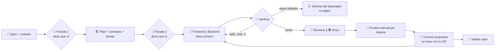

<div align="center">

# 🧭 sdd-harness

**Un harness portable, con humano en el bucle, para Spec-Driven Development con agentes de IA.**
Primero la spec. Subagentes para frontend y backend. Guardarraíles deterministas. Tú mantienes el control.

[](README.md)
[](README.es.md)


</div>

---

> [!WARNING]
> 🚧 **En desarrollo.** Este README describe el diseño objetivo. Los comandos que aparecen como pendientes en la [hoja de ruta](#️-hoja-de-ruta) pueden no existir todavía.

## ✨ ¿Qué es esto?

**Agente = modelo + harness.** El harness es todo lo que rodea al modelo: contexto, memoria, orquestación, verificación y control de costos. `sdd-harness` empaqueta todo eso en una CLI que instalas **una vez** y activas **por proyecto**. Los proyectos que no lo activan nunca se tocan.

Implementa el flujo de Spec-Driven Development:

**Spec → Plan y tareas → Implementación (frontend y backend en paralelo, tests primero) → Validación, con la documentación siempre al día. Un cambio va primero a la spec y luego al código.**

Sobre ese flujo añade subagentes de frontend y backend, un agente de QA, un revisor, un depurador y un documentador, coordinados por un orquestador. **Solo se detiene dos veces**, para aprobar la spec y el plan, y respondes hablando ("sí", "continúa"). Lo demás avanza y se cuenta en los resúmenes.

### 🧠 Principio central

> **Usar lo que la herramienta ya tiene y no estorbar nunca.**

El harness reutiliza los permisos, subagentes, skills y preguntas de Claude Code en lugar de reinventarlos. Solo pregunta lo irreversible (push, reescribir historial, dependencias) y solo bloquea el propio harness. Todo lo demás es un aviso: el trabajo nunca se atasca.

---

## 🚀 Características

| | Característica | Qué significa para ti |
|---|---|---|
| 📝 | **Flujo Spec-Driven** | Requisitos EARS numerados (`RF-1…`), clarificación, plan, contrato API y tareas con "Hecho cuando" |
| 🤖 | **Subagentes especializados** | Frontend y backend trabajan por separado, cada uno solo en sus rutas |
| 🎨 | **Frontend con criterio de diseño** | Skills de diseño, sistema de diseño y componentes reutilizables; la fuente de diseño es configurable (ninguna, tokens en código, Penpot, Figma) |
| 🔐 | **Backend seguro y con arquitectura** | Capas, convenciones de API, código seguro y migraciones de BD seguras |
| 🧪 | **Agente de QA** | Tests unitarios, de integración y E2E (Playwright), con reportes de errores reproducibles |
| 🛑 | **Dos paradas, hablando** | Apruebas la spec y el plan con "sí" o "continúa". El commit se propone al cerrar cada historia y se hace con tu OK |
| 🔁 | **Cortacircuitos** | Máximo 2 intentos de corrección; después, informe del depurador con opciones y eliges tú |
| 🗂️ | **Repo ordenado** | Lista blanca de `.md`: los agentes no crean documentos donde quieran |
| 🔌 | **Multiherramienta** | Un núcleo neutral y adaptadores para Claude Code, opencode, Codex y Antigravity |
| 🧩 | **Cualquier topología** | Repo único, monorepo, varios repos o una carpeta de trabajo con varios repos |
| 📋 | **Tracker opcional** | Sincronización bidireccional con Linear, Notion, GitHub Issues o Jira. Desactivado por defecto |
| 📊 | **Observabilidad** | Log de eventos por tarea, costo por spec y un nivel de modelo por rol |
| 🪟 | **Multiplataforma** | Node.js puro. Sin bash, sin symlinks, sin dependencias añadidas a tu proyecto |

---

## 🔄 El pipeline



---

## ⚡ Inicio rápido

**Requisitos:** Node.js ≥ 24 (LTS), Git y al menos una herramienta de agentes compatible.

```bash
# 1. Instala la CLI una vez (global; no se instala nada más de forma global)
npm install -g github:attisDev92/Dev-Harness-SDD

# 2. Actívalo en un proyecto
cd mi-proyecto
sdd-harness-init        # entrevista corta → genera la configuración SOLO para este proyecto

# 3. Comprueba que todo está conectado
sdd-harness doctor
```

Luego abre tu herramienta de agentes en el proyecto y di lo que quieres:

```
Quiero un login de usuario con email y contraseña
```

Para quitarlo de un proyecto:

```bash
sdd-harness remove      # borra solo lo generado y no modificado. Nunca toca specs/ ni docs/
```

---

## 🛠️ Comandos de la CLI

| Comando | Descripción |
|---|---|
| `sdd-harness-init` | Entrevista e instalación en el proyecto actual: herramientas, topología, stack, convenciones, fuente de diseño, tracker y pruebas manuales |
| `sdd-harness sync` | Regenera la configuración de cada herramienta desde `harness.config.yaml`, mostrando antes el diff |
| `sdd-harness doctor` | Revisión de salud y **nivel real de enforcement** de cada herramienta activada |
| `sdd-harness skills list \| install \| update \| verify` | Gestiona las skills y plugins requeridos (fijados por versión y verificados) |
| `sdd-harness contracts sync` | Actualiza los snapshots de contratos API desde los repos proveedores |
| `sdd-harness tracker connect \| sync \| status` | Sincronización bidireccional entre `tasks.md` y tu tracker |
| `sdd-harness workspace init` | Configura un workspace local sobre varios repos |
| `sdd-harness upgrade` | Actualiza a una versión nueva del harness, con diff y confirmación |
| `sdd-harness remove` | Desinstalación limpia guiada por `.harness/manifest.lock` |

## 💬 Dentro de tu agente

Di lo que quieres ("añade recuperar contraseña") y la skill `sdd` dirige el flujo. Solo se te pregunta en las **dos paradas** (spec, y plan con tareas) y para dar el OK a cada commit; basta con "sí", "continúa", "aprobado" o el botón "Aprobar".

Los comandos `/sdd:*` son **atajos opcionales** para ver qué pasó o lanzar trabajo en paralelo. Ninguno hace falta para avanzar:

| Comando | Para qué |
|---|---|
| `/sdd:status` | Qué pasó: spec y estado, últimas tareas cerradas, pendientes, última verificación, últimos commits |
| `/sdd:spec <idea>` | Empezar una spec |
| `/sdd:next` | Lanzar en paralelo las tareas listas (frontend ∥ backend) |
| `/sdd:docs` | Poner la documentación al día en segundo plano |
| `/sdd:review` | Revisión (y QA) en paralelo de lo cambiado |
| `/sdd:validate` | Informe requisito → test |
| `/sdd:commit` | Proponer el commit ahora |

> [!NOTE]
> La sintaxis de invocación varía según la herramienta. Por ejemplo, Codex invoca las skills como `$nombre` y Antigravity las expone como workflows con `/`. `sdd-harness doctor` te muestra la sintaxis correcta para tu configuración.

---

## 🤖 Agentes

Solo se generan los agentes que tu proyecto necesita. Un proyecto solo de frontend no tiene agente de backend.

| Agente | Rol | Escribe en | Skills clave | Nivel |
|---|---|---|---|---|
| 🧐 `spec-reviewer` | QA de la spec. Detecta problemas, nunca los resuelve | — (solo lectura) | spec-generator (modo revisión) | alto |
| 🏗️ `architect` | Plan, contrato API y propuestas de ADR | `specs/**`, `docs/decisions/**` | api-design, backend-architecture, adr | alto |
| 🎨 `frontend-dev` | UI, sistema de diseño, componentes | solo rutas de frontend | frontend-design, design-system, web-design-guidelines, clean-code, TDD (+ skills de React/Next si se detectan) | medio |
| ⚙️ `backend-dev` | API, dominio, persistencia | solo rutas de backend | backend-architecture, api-design, secure-coding, db-migrations, clean-code, TDD (+ skill de Postgres si se detecta) | medio |
| 🧪 `qa-tester` | Unitarios, integración, E2E, reportes de errores | `tests/**`, `e2e/**` | webapp-testing, testing-strategy, TDD | medio |
| 👀 `reviewer` | Cumplimiento de la spec, luego calidad y seguridad | — (solo lectura) | code-review, secure-coding, verification-before-completion | alto |
| 🩺 `debugger` | Triage de causa raíz. Reporta opciones, **no arregla** | — (solo lectura) | systematic-debugging, triage-report | alto |
| 📚 `doc-writer` | Actualiza solo los docs permitidos | `.md` de la lista blanca | docs-writer | bajo |

Los niveles (`alto` / `medio` / `bajo`) se traducen a modelos concretos en cada herramienta mediante los adaptadores.

> [!IMPORTANT]
> En Claude Code los subagentes no pueden lanzar otros subagentes, así que **el orquestador es tu sesión principal**, guiada por la skill `sdd`. En las herramientas sin subagentes equivalentes, el harness funciona en **modo degradado**: los roles se ejecutan uno tras otro en el mismo agente.

---

## 🧩 Skills

El harness incluye sus propias skills e instala skills de terceros curadas **bajo demanda, fijadas por versión y verificadas**. Las skills se cargan según el rol y el stack detectado, así que ningún agente carga skills que no necesita.

### Incluidas (propias del harness)

| Skill | La usa | Propósito |
|---|---|---|
| `sdd` | sesión principal | El flujo: dos paradas, tareas en paralelo, revisión y docs, commit por historia |
| `spec-generator` | fase de spec | Entrevista de requisitos y spec EARS (inspirada en [hello-sdd](https://github.com/mouredev/hello-sdd)) |
| `clean-code` | frontend, backend | Nombres claros, unidades pequeñas, KISS/YAGNI/DRY, sin abstracciones prematuras. **Mandan las convenciones del proyecto** |
| `design-system` | frontend | Tokens, API de componentes, variantes, estados. Se adapta a la fuente de diseño elegida |
| `backend-architecture` | backend, architect | Capas, fronteras, dirección de dependencias, manejo de errores, validación en los bordes |
| `api-design` | backend, architect | Convenciones REST, paginación, formato de error consistente, versionado, contrato primero |
| `secure-coding` | backend, reviewer | Checklist basado en OWASP: autenticación y autorización, entradas, secretos, cabeceras |
| `db-migrations` | backend | Migraciones seguras (expand/contract, reversibles). Todo cambio de esquema lleva un borrador de ADR |
| `testing-strategy` | QA | Pirámide de tests, datos de prueba, evitar tests inestables, uno o más tests por RF |
| `triage-report` | debugger | Informe fijo: error, reproducción, hipótesis, 2–3 opciones, recomendación. Luego se detiene |
| `adr` | architect | Registros de decisiones de arquitectura con las alternativas descartadas |
| `docs-writer` | docs | Lista blanca de docs, actualización de README/CHANGELOG/arquitectura |

### De terceros, curadas (se instalan si faltan)

| Skill | Origen | Se instala cuando |
|---|---|---|
| `frontend-design` | anthropics | existe un componente de frontend |
| `webapp-testing` | anthropics | existe un frontend web (Playwright) |
| `web-design-guidelines` | vercel-labs | listada pero bloqueada: no declara licencia (RF-SKL-15) |
| `vercel-react-best-practices`, `vercel-composition-patterns` | vercel-labs | se detecta React o Next.js |
| `supabase-postgres-best-practices` | supabase | se detecta PostgreSQL |
| `test-driven-development`, `systematic-debugging`, `verification-before-completion` | obra/superpowers | siempre (solo estas skills, no el plugin completo) |

Con `design.source: figma` o `penpot`, el harness configura el servidor MCP de la herramienta de diseño en `.mcp.json` en lugar de una skill. Para proponer una skill al registro, mira [docs/guides/registro-skills.md](docs/guides/registro-skills.md).

> [!CAUTION]
> Hay skills publicadas que contienen hooks o scripts maliciosos. El instalador **solo** instala skills del registro curado. Cada una está fijada a un SHA de commit, verificada por hash y licencia, y se te muestra para confirmar **antes** de instalarla. Nunca instala nada de forma global. Las nuevas entradas del registro pasan por revisión de código.

---

## 🛑 Guardarraíles

| Regla | Mecanismo |
|---|---|
| 💾 **Commit por historia, con tu OK** | Al cerrar una historia el agente propone el commit y lo hace si dices que sí. Push, rebase, merge, reset, borrar ramas y tags piden confirmación nativa |
| 📦 **Instalar dependencias te pregunta** | Permiso `ask` en los comandos de instalación. Editar a mano manifiestos o lockfiles solo genera un aviso |
| 🔔 **Avisos, no muros** | Zonas protegidas, código sin tarea o fuera de su alcance: el harness avisa una vez y deja seguir. Solo se bloquea `.harness/` y los archivos generados |
| 🧩 **Tareas que surgen** | Se añaden a `tasks.md` como "añadida en implementación", sin parar |
| 🔁 **Sin bucles infinitos** | Máximo **2** intentos de corrección. Después, informe del depurador → tú eliges |
| 🧑 **Pruebas lo que importa** | URL, pasos y datos de prueba con la granularidad que elijas (`task`, `story`, `spec` o `none`) |
| 🗂️ **Documentación siempre al día** | Se puede escribir cualquier `.md`; los agentes deben actualizar todo documento que un cambio afecte. La lista blanca es opcional (`gates.docs: whitelist`) |
| ⚡ **Agentes en paralelo** | Las tareas de frontend y backend avanzan a la vez; una tarea solo espera a su propio `Depends on` |
| 🧱 **Cada agente en su carril** | Propiedad de rutas por agente, verificada con `git diff` al terminar cada subagente (un aviso, y solo si trabajó solo) |
| ✅ **Nada se da por hecho con tests en rojo** | El hook de parada se lo recuerda al agente una vez si la última verificación falló |

**Red de seguridad universal:** un pre-commit de git (vía `core.hooksPath`, en Node puro, sin husky) rechaza secretos y archivos `.env`; una plantilla de CI añade la lista blanca de docs y la verificación completa.

### Nivel de enforcement por herramienta

| Herramienta | Contexto | Skills | Subagentes | Bloqueo determinista | Nivel |
|---|---|---|---|---|---|
| Claude Code | `CLAUDE.md` → `@AGENTS.md` | ✅ | ✅ | permisos + hooks | 🟢 fuerte |
| opencode | `AGENTS.md` | ✅ | ✅ | `permission.bash` + plugins | 🟢 medio-fuerte |
| Codex | `AGENTS.md` | ✅ | ✅ | hooks (beta) + política de aprobación | 🟡 medio |
| Antigravity | `AGENTS.md` | ✅ | modo degradado | allow/deny list de terminal | 🟠 débil → git hooks + CI |

Ejecuta `sdd-harness doctor` para ver qué se aplica realmente en tu proyecto.

---

## ⚙️ Configuración

`sdd-harness-init` genera `harness.config.yaml`, y a partir de ahí puede cambiar **en cualquier momento, también a mitad del desarrollo**: lo editas tú o el agente, Claude Code te pide confirmar la edición y un hook regenera la configuración al instante (`sdd-harness sync`). `.harness/` y los archivos generados siguen siendo intocables.

`AGENTS.md` y `CLAUDE.md` también son tuyos: el harness solo es dueño del bloque entre `<!-- harness:begin -->` y `<!-- harness:end -->`. El agente puede añadir instrucciones del proyecto en cualquier otra parte del archivo, nunca dentro del bloque.

Este es un ejemplo para un workspace con dos repos:

```yaml
harness_version: 1.0.0
install_mode: local            # local (por defecto) | team
tools: [claude-code, opencode]

language:                      # se detecta de las convenciones existentes y luego se confirma contigo
  code: en
  specs: es
  docs: es
  commits: en
  ui: es

topology: workspace            # single | monorepo | multi-repo | workspace
specs:
  location: root               # root (por defecto) | per-repo (solo multi-repo / workspace)
  id_prefix: SPEC              # SPEC-001-login; las specs son del proyecto, no de un componente
components:
  web: { path: ./web-app, stack: "react+vite+ts" }
  api: { path: ./api,     stack: "nestjs+postgres" }

design:
  source: none                 # none | tokens-in-code | penpot | figma

tracker:
  enabled: false               # linear | notion | github | jira, sincronizado en ambos sentidos

gates:
  manual_test: story           # task | story | spec | none
  docs: free                   # free | whitelist
  commits: per-story           # el agente propone el commit al cerrar cada historia
  deps: ask

retries:
  in_scope: 2                  # intentos de corrección antes del informe del depurador

protected:
  deps:         [package.json#dependencies, lockfiles]
  db:           ["**/migrations/**", "**/schema.prisma", "**/*.sql"]
  contracts:    ["specs/**/contracts/**"]
  architecture: ["docker-compose*", ".env*"]
  tooling:      ["tsconfig*.json", "**/eslint.config.*", "Dockerfile*", ".github/workflows/**"]  # lint, tsconfig, CI: solo preguntan, sin tarea ni ADR
  security:     [auth, cors, csp]

docs_whitelist:
  - README.md
  - CHANGELOG.md
  - "specs/*/{spec,plan,tasks,progress}.md"
  - "docs/decisions/ADR-*.md"
  - "docs/architecture/*.md"
  - docs/lessons.md
```

### Modos de instalación

- **`local` (por defecto).** La configuración generada se oculta con `.git/info/exclude`, así que tampoco se toca tu `.gitignore`. Se usan los archivos locales de cada herramienta cuando existen. **Nunca se modifican archivos versionados.** Tu equipo no ve nada.
- **`team`.** La configuración generada se commitea. Los archivos existentes reciben un bloque gestionado (`<!-- harness:begin --> … <!-- harness:end -->`) en lugar de sobrescribirse.

Las specs, los contratos y los docs son artefactos *de tu proyecto*. `init` te pregunta si se commitean o se quedan en local.

### Primero las convenciones del proyecto

`init` lee lo que el proyecto ya declara: `AGENTS.md`, `CLAUDE.md`, `CONTRIBUTING.md`, `.editorconfig`, linters. Te muestra lo que detectó y te pide confirmación. El orden de precedencia es:

**constitución → convenciones del proyecto → skills del harness → skills de terceros**

---

## 🧱 Topologías y specs

| Topología | Dónde viven las specs y los contratos |
|---|---|
| Repo único / monorepo | `specs/` en la raíz |
| Cualquier topología (por defecto) | `specs/` en la raíz, con un prefijo único del proyecto (`SPEC-004`) |
| Varios repos / workspace con `specs.location: per-repo` | **Cada repo es dueño de sus specs.** `new-spec --component <id>` elige el repo y un componente puede definir su propio `id_prefix` opcional (`API-004`) |

Las referencias entre repos usan IDs estables (`depends_on: api#API-004`). **El proveedor es dueño del contrato**, y los consumidores guardan un snapshot con metadatos de origen:

```
api/specs/API-004-auth/contracts/openapi.yaml          ← fuente de verdad
web/specs/WEB-007-login/contracts/external/api-openapi.yaml   ← snapshot (repo, spec, commit)
```

`sdd-harness doctor` avisa cuando un snapshot se desvió de su proveedor. Adaptarse a un contrato que cambió se habla antes contigo.

### Estructura generada en el proyecto

```
mi-proyecto/
├─ harness.config.yaml
├─ AGENTS.md · CLAUDE.md (@AGENTS.md)
├─ .agents/skills/              # skills canónicas (+ copias para las herramientas que las necesitan)
├─ .claude/ · .opencode/ · .codex/ · .agents/workflows/   # solo para las herramientas activadas
├─ .harness/
│  ├─ scripts/                  # guardianes, en Node
│  ├─ githooks/                 # red de seguridad universal
│  ├─ manifest.lock             # archivos generados + hashes, usado por `remove`
│  ├─ skills.lock               # skills de terceros fijadas
│  ├─ state/  logs/             # nunca se commitean
├─ specs/NNN-feature/  spec · plan · contracts/ · tasks · progress
└─ docs/  constitution · decisions/ · architecture/ · lessons.md
```

---

## 📋 Sincronización con el tracker (opcional)

- `tasks.md` sigue siendo legible. Cada tarea lleva su vínculo: `- [ ] T3 … <!-- linear:ABC-123 -->`.
- Solo se sincronizan **estado, título y tareas nuevas**, en ambos sentidos. La spec nunca se edita desde el tracker.
- Las tareas creadas en el tracker llegan como **propuestas** y necesitan tu aprobación.
- Los conflictos **nunca** se resuelven solos. Ves ambos lados y eliges.
- La sincronización se hace desde la CLI, por la API del tracker, con tokens tomados de variables de entorno.

---

## 📊 Observabilidad

- `.harness/logs/events.jsonl` registra specs, paradas, verificaciones y subagentes.
- `/sdd:status` muestra qué pasó: últimas tareas cerradas, pendientes, última verificación y últimos commits.
- Un nivel de modelo por rol reserva los modelos caros para donde razonar compensa.
- Se soporta OpenTelemetry nativo en las herramientas que lo ofrecen.

---

## 🗺️ Hoja de ruta

- [x] **MVP** Claude Code: `init` / `sync` / `doctor` / `remove` / `upgrade`, flujo SDD completo, avisos, dos paradas de aprobación, git hooks, mensajes en español
- [x] Flujo ligero (v0.8): aprobar hablando, commit por historia, tareas y cambios de configuración a mitad del desarrollo
- [x] Topologías de varios repos y workspace, dependencias entre specs y snapshots de contratos
- [ ] Adaptadores de opencode, Codex y Antigravity, y modo degradado
- [x] Registro de skills e instalador verificado
- [x] Sincronización bidireccional con cualquier tracker: GitHub desde la CLI, el resto desde el agente con su MCP
- [x] Matriz de CI multiplataforma (Windows, macOS, Linux · Node 24 LTS)
- [ ] Costo por tarea, mensajes en inglés y primera versión estable

---

## 🤝 Contribuir

Las contribuciones son bienvenidas, sobre todo nuevos **adaptadores**, **conectores de trackers** y **skills curadas**.

1. Haz un fork y crea una rama.
2. Este repo se construye **con su propio método**: abre una spec en `specs/` antes de escribir código.
3. Las nuevas skills de terceros necesitan una entrada en el registro (origen, SHA fijado, licencia, hash) y revisión de código: [guía](docs/guides/registro-skills.md).
4. Nuevas herramientas de agentes: [guía de adaptadores](docs/guides/adaptadores.md).
5. Los PRs deben pasar la matriz de CI de Windows, macOS y Linux.

Guía de uso completa: [docs/guides/uso.md](docs/guides/uso.md).

## 🙏 Créditos e inspiración

- [**hello-sdd**](https://github.com/mouredev/hello-sdd) de MoureDev: flujo SDD, specs EARS y la idea de la skill `spec-generator` (Apache-2.0). Ver [NOTICE](NOTICE)
- [**GitHub Spec Kit**](https://github.com/github/spec-kit): el flujo constitution/specify/plan/tasks
- [**anthropics/skills**](https://github.com/anthropics/skills): `frontend-design`, `webapp-testing`, `skill-creator`
- [**obra/superpowers**](https://github.com/obra/superpowers): TDD, depuración sistemática, verificación antes de terminar
- [**vercel-labs/agent-skills**](https://github.com/vercel-labs/agent-skills) y [**supabase/agent-skills**](https://github.com/supabase/agent-skills)
- La idea de **Harness Engineering**: *agente = modelo + harness*

## 📄 Licencia

[Apache-2.0](LICENSE). Las skills de terceros conservan sus propias licencias y se descargan desde sus fuentes originales al instalarlas.

<div align="center">

Hecho con 🧭 para quienes quieren la velocidad de la IA **sin** perder el control.

</div>
