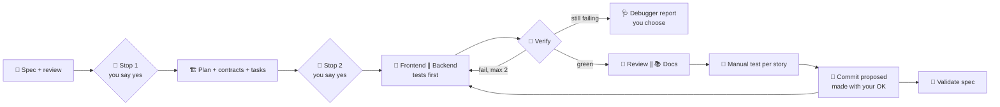

<div align="center">

# 🧭 sdd-harness

**A portable, human-in-the-loop harness for Spec-Driven Development with AI coding agents.**
Specs first. Sub-agents for frontend and backend. Deterministic guardrails. You stay in control.

[](README.md)
[](README.es.md)


</div>

---

> [!WARNING]
> 🚧 **Work in progress.** This README describes the target design. Commands marked as planned in the [roadmap](#-roadmap) may not exist yet.

## ✨ What is this?

**Agent = model + harness.** The harness is everything around the model: context, memory, orchestration, verification, and cost control. `sdd-harness` packages all of that into a CLI you install **once** and enable **per project**. Projects that don't opt in are never touched.

It implements the Spec-Driven Development flow:

**Spec → Plan and tasks → Implement (frontend and backend in parallel, tests first) → Validate, with the docs always up to date. A change goes to the spec first, then to the code.**

On top of that flow it adds sub-agents for frontend and backend, a QA agent, a reviewer, a debugger and a docs writer, all coordinated by an orchestrator. It **stops only twice**, to approve the spec and the plan, and you answer by talking ("yes", "continue"). Everything else moves on and is told in summaries.

### 🧠 Core principle

> **Use what the tool already has, and never get in the way.**

The harness reuses Claude Code's own permissions, sub-agents, skills and questions instead of reinventing them. Only what is irreversible asks (push, history rewrites, dependencies) and only the harness itself is blocked. Everything else is an alert: the work never stalls.

---

## 🚀 Features

| | Feature | What it means for you |
|---|---|---|
| 📝 | **Spec-Driven flow** | Numbered EARS requirements (`RF-1…`), clarification, plan, API contract, tasks with "Done when" |
| 🤖 | **Specialized sub-agents** | Frontend and backend work separately, each only in its own paths |
| 🎨 | **Design-aware frontend** | Design skills, a reusable design system and components; design source is configurable (none, tokens-in-code, Penpot, Figma) |
| 🔐 | **Secure, architecture-aware backend** | Layering, API conventions, secure coding, safe DB migrations |
| 🧪 | **QA agent** | Unit, integration and E2E (Playwright), with reproducible bug reports |
| 🛑 | **Two stops, by talking** | You approve the spec and the plan with "yes" or "continue". Commits are proposed when a story closes and made with your OK |
| 🔁 | **Loop breaker** | At most 2 fix attempts; then a debugger report with options and you choose |
| 🗂️ | **Tidy repo** | `.md` whitelist: agents can't create documents wherever they like |
| 🔌 | **Multi-tool** | One neutral core, adapters for Claude Code, opencode, Codex and Antigravity |
| 🧩 | **Any topology** | Single repo, monorepo, multi-repo, or a workspace folder with several repos |
| 📋 | **Optional tracker** | Two-way sync with Linear, Notion, GitHub Issues or Jira. Off by default |
| 📊 | **Observability** | Per-task event log, cost per spec, and a model tier per role |
| 🪟 | **Cross-platform** | Pure Node.js. No bash, no symlinks, no dependencies added to your project |

---

## 🔄 The pipeline



---

## ⚡ Quick start

**Requirements:** Node.js ≥ 24 (LTS), Git, and at least one supported agent tool.

```bash
# 1. Install the CLI once (global, nothing else is installed globally)
npm install -g github:attisDev92/Dev-Harness-SDD

# 2. Enable it in a project
cd my-project
sdd-harness-init        # short interview → generates config for THIS project only

# 3. Check everything is wired
sdd-harness doctor
```

Then open your agent tool in the project and just say what you want:

```
I want a user login with email and password
```

To remove it from a project:

```bash
sdd-harness remove      # deletes only generated, unmodified files. Never touches specs/ or docs/
```

---

## 🛠️ CLI commands

| Command | Description |
|---|---|
| `sdd-harness-init` | Interview and install into the current project: tools, topology, stack, conventions, design source, tracker, manual tests |
| `sdd-harness sync` | Regenerate tool configs from `harness.config.yaml`, showing a diff first |
| `sdd-harness doctor` | Health check, plus the **real enforcement level** for each enabled tool |
| `sdd-harness skills list \| install \| update \| verify` | Manage the required skills and plugins (pinned, verified) |
| `sdd-harness contracts sync` | Refresh API contract snapshots from provider repos |
| `sdd-harness tracker connect \| sync \| status` | Two-way sync between `tasks.md` and your tracker |
| `sdd-harness workspace init` | Set up a local workspace over several repos |
| `sdd-harness upgrade` | Move to a newer harness version, with a diff and confirmation |
| `sdd-harness remove` | Clean uninstall driven by `.harness/manifest.lock` |

## 💬 Inside your agent

Just say what you want ("add a password reset") and the `sdd` skill runs the flow. You are asked only at the **two stops** (spec, plan with tasks) and to okay each commit; "yes", "continue", "approved" or the "Approve" button are enough.

The `/sdd:*` commands are **optional shortcuts** to see what happened or to launch work in parallel. None of them is needed to move on:

| Command | What for |
|---|---|
| `/sdd:status` | What happened: spec and status, last tasks closed, pending ones, last verification, last commits |
| `/sdd:spec <idea>` | Start a spec |
| `/sdd:next` | Launch the ready tasks in parallel (frontend ∥ backend) |
| `/sdd:docs` | Bring the docs up to date in the background |
| `/sdd:review` | Review (and QA) of the recent changes, in parallel |
| `/sdd:validate` | Requirement → test report |
| `/sdd:commit` | Propose the commit now |

> [!NOTE]
> Invocation syntax varies by tool. For example, Codex invokes skills as `$name`, and Antigravity exposes these as workflows under `/`. `sdd-harness doctor` prints the right syntax for your setup.

---

## 🤖 Agents

Only the agents your project needs are generated. A frontend-only project gets no backend agent.

| Agent | Role | Writes to | Key skills | Tier |
|---|---|---|---|---|
| 🧐 `spec-reviewer` | QA of the spec. Detects problems, never resolves them | — (read only) | spec-generator (review mode) | high |
| 🏗️ `architect` | Plan, API contract, ADR proposals | `specs/**`, `docs/decisions/**` | api-design, backend-architecture, adr | high |
| 🎨 `frontend-dev` | UI, design system, components | frontend paths only | frontend-design, design-system, web-design-guidelines, clean-code, TDD (+ React/Next skills if detected) | mid |
| ⚙️ `backend-dev` | API, domain, persistence | backend paths only | backend-architecture, api-design, secure-coding, db-migrations, clean-code, TDD (+ Postgres skill if detected) | mid |
| 🧪 `qa-tester` | Unit, integration, E2E, bug reports | `tests/**`, `e2e/**` | webapp-testing, testing-strategy, TDD | mid |
| 👀 `reviewer` | Spec compliance, then code quality and security | — (read only) | code-review, secure-coding, verification-before-completion | high |
| 🩺 `debugger` | Root-cause triage. Reports options, **does not fix** | — (read only) | systematic-debugging, triage-report | high |
| 📚 `doc-writer` | Updates whitelisted docs only | whitelisted `.md` | docs-writer | low |

Tiers (`high` / `mid` / `low`) map to concrete models per tool through the adapters.

> [!IMPORTANT]
> In Claude Code, sub-agents cannot spawn other sub-agents, so the **orchestrator is your main session**, driven by the `sdd` skill. In tools without equivalent sub-agents, the harness runs in **degraded mode**: roles run one after another in the same agent.

---

## 🧩 Skills

The harness bundles its own skills and installs curated third-party skills **on demand, pinned and verified**. Skills are loaded per role and per detected stack, so an agent never carries skills it doesn't need.

### Bundled (owned by the harness)

| Skill | Used by | Purpose |
|---|---|---|
| `sdd` | main session | The flow: two stops, parallel tasks, review and docs, commit per story |
| `spec-generator` | spec phase | Requirements interview and EARS spec (inspired by [hello-sdd](https://github.com/mouredev/hello-sdd)) |
| `clean-code` | frontend, backend | Naming, small units, KISS/YAGNI/DRY, no premature abstraction. **Project conventions win** |
| `design-system` | frontend | Tokens, component API, variants, states. Adapts to the chosen design source |
| `backend-architecture` | backend, architect | Layers, boundaries, dependency direction, error handling, validation at the edges |
| `api-design` | backend, architect | REST conventions, pagination, a consistent error format, versioning, contract-first |
| `secure-coding` | backend, reviewer | OWASP-based checklist: authN/authZ, input handling, secrets, headers |
| `db-migrations` | backend | Safe migrations (expand/contract, reversible). Every schema change gets an ADR draft |
| `testing-strategy` | QA | Test pyramid, test data, avoiding flaky tests, one or more tests per RF |
| `triage-report` | debugger | Fixed report format: error, reproduction, hypotheses, 2–3 options, recommendation. Then stop |
| `adr` | architect | Architecture Decision Records with the discarded alternatives |
| `docs-writer` | docs | Docs whitelist, README/CHANGELOG/architecture updates |

### Curated third-party (installed if missing)

| Skill | Source | Installed when |
|---|---|---|
| `frontend-design` | anthropics | a frontend component exists |
| `webapp-testing` | anthropics | a web frontend exists (Playwright) |
| `web-design-guidelines` | vercel-labs | listed but blocked: it declares no license (RF-SKL-15) |
| `vercel-react-best-practices`, `vercel-composition-patterns` | vercel-labs | React or Next.js detected |
| `supabase-postgres-best-practices` | supabase | PostgreSQL detected |
| `test-driven-development`, `systematic-debugging`, `verification-before-completion` | obra/superpowers | always (these individual skills only, not the whole plugin) |

With `design.source: figma` or `penpot` the harness configures the design tool's MCP server in `.mcp.json` instead of a skill. To propose a skill for the registry, see [docs/guides/skills-registry.md](docs/guides/skills-registry.md).

> [!CAUTION]
> Published skills can contain malicious hooks or scripts. The installer **only** installs skills from the curated registry. Each one is pinned to a commit SHA, verified by hash and license, and listed for your confirmation **before** installation. It never installs anything globally. New registry entries go through code review.

---

## 🛑 Guardrails

| Rule | Mechanism |
|---|---|
| 💾 **Commit per story, with your OK** | When a story closes the agent proposes the commit and makes it if you say yes. Push, rebase, merge, reset, deleting branches and tags ask natively |
| 📦 **Dependency installs ask you** | `ask` permission on install commands. Editing manifests or lockfiles by hand only raises an alert |
| 🔔 **Alerts, not walls** | Protected zones, code without a task or outside its scope: the harness warns once and lets the work go on. Only `.harness/` and generated files are blocked |
| 🧩 **Tasks that come up** | Added to `tasks.md` as "added during implementation", without stopping |
| 🔁 **No infinite loops** | Max **2** fix attempts. Then debugger report → you choose |
| 🧑 **You test what matters** | URL, steps and test data at the granularity you choose (`task`, `story`, `spec` or `none`) |
| 🗂️ **Docs always up to date** | Any `.md` can be written; agents must update every document a change affects. A whitelist is opt-in (`gates.docs: whitelist`) |
| ⚡ **Parallel agents** | Frontend and backend tasks run at once; a task waits only for its own `Depends on` |
| 🧱 **Agents stay in their lane** | Path ownership per agent, checked with `git diff` when a sub-agent ends (an alert, and only when it ran alone) |
| ✅ **No "done" with red tests** | The Stop hook reminds the agent once when the last verification failed |

**Universal safety net:** a git pre-commit (via `core.hooksPath`, pure Node, no husky) refuses secrets and `.env` files; a CI template adds the docs whitelist and the full verification.

### Enforcement level by tool

| Tool | Context | Skills | Sub-agents | Deterministic blocking | Level |
|---|---|---|---|---|---|
| Claude Code | `CLAUDE.md` → `@AGENTS.md` | ✅ | ✅ | permissions + hooks | 🟢 strong |
| opencode | `AGENTS.md` | ✅ | ✅ | `permission.bash` + plugins | 🟢 medium-strong |
| Codex | `AGENTS.md` | ✅ | ✅ | hooks (beta) + approval policy | 🟡 medium |
| Antigravity | `AGENTS.md` | ✅ | degraded mode | terminal allow/deny list | 🟠 weak → git hooks + CI |

Run `sdd-harness doctor` to see what is actually enforced in your project.

---

## ⚙️ Configuration

`sdd-harness-init` writes `harness.config.yaml`, and from then on it can change **at any moment, even mid-development**: you or the agent edit it, Claude Code asks you to confirm the edit, and a hook regenerates the configuration right away (`sdd-harness sync`). `.harness/` and generated files stay off-limits.

`AGENTS.md` and `CLAUDE.md` are yours too: the harness only owns the block between `<!-- harness:begin -->` and `<!-- harness:end -->`. The agent can add project instructions anywhere else in the file, never inside the block.

Here is an example for a workspace with two repos:

```yaml
harness_version: 1.0.0
install_mode: local            # local (default) | team
tools: [claude-code, opencode]

language:                      # detected from existing conventions, then confirmed with you
  code: en
  specs: es
  docs: es
  commits: en
  ui: es

topology: workspace            # single | monorepo | multi-repo | workspace
specs:
  location: root               # root (default) | per-repo (multi-repo / workspace only)
  id_prefix: SPEC              # SPEC-001-login; specs belong to the project, not to a component
components:
  web: { path: ./web-app, stack: "react+vite+ts" }
  api: { path: ./api,     stack: "nestjs+postgres" }

design:
  source: none                 # none | tokens-in-code | penpot | figma

tracker:
  enabled: false               # linear | notion | github | jira, synced both ways

gates:
  manual_test: story           # task | story | spec | none
  docs: free                   # free | whitelist
  commits: per-story           # the agent proposes the commit when a story closes
  deps: ask

retries:
  in_scope: 2                  # fix attempts before the debugger report

protected:
  deps:         [package.json#dependencies, lockfiles]
  db:           ["**/migrations/**", "**/schema.prisma", "**/*.sql"]
  contracts:    ["specs/**/contracts/**"]
  architecture: ["docker-compose*", ".env*"]
  tooling:      ["tsconfig*.json", "**/eslint.config.*", "Dockerfile*", ".github/workflows/**"]  # lint, tsconfig, CI: only ask, no task or ADR needed
  security:     [auth, cors, csp]

docs_whitelist:
  - README.md
  - CHANGELOG.md
  - "specs/*/{spec,plan,tasks,progress}.md"
  - "docs/decisions/ADR-*.md"
  - "docs/architecture/*.md"
  - docs/lessons.md
```

### Install modes

- **`local` (default).** Generated config is hidden through `.git/info/exclude`, so your `.gitignore` isn't touched either. Each tool's local-only files are used where available. **Tracked files are never modified.** Teammates see nothing.
- **`team`.** Generated config is committed. Existing files get a managed block (`<!-- harness:begin --> … <!-- harness:end -->`) instead of being overwritten.

Specs, contracts and docs are *your* project artifacts. `init` asks whether they are committed or kept local.

### Conventions come first

`init` reads what the project already declares: `AGENTS.md`, `CLAUDE.md`, `CONTRIBUTING.md`, `.editorconfig`, linters. It shows what it detected and asks you to confirm. The precedence is:

**constitution → project conventions → sdd-harness skills → third-party skills**

---

## 🧱 Topologies and specs

| Topology | Where specs and contracts live |
|---|---|
| Any topology (default) | `specs/` at the root, one project prefix (`SPEC-004`) |
| Multi-repo / workspace with `specs.location: per-repo` | **Each repo owns its specs.** `new-spec --component <id>` picks the repo, and a component may define its own optional `id_prefix` (`API-004`) |

**Several developers on different branches.** `new-spec` skips the numbers that already exist on other local and remote branches, so two specs created at the same time do not get the same number. Remote branches count as of the last `git fetch`, which the agent runs first, and a spec only counts once its branch has a commit with it. To fix an agreed number, use `new-spec <name> --id <NNN>` (for example, by telling the agent "create the spec with id 7"). If the number already exists on the current branch, the harness refuses it. If it exists on another branch, it warns.

In a brand-new empty monorepo, `init` asks for each component's path (e.g. `apps/web`, `apps/api`) and kind, and offers to add another. A spec belongs to the project, not to a component: a full-stack feature is one spec whose tasks each declare their `Component`.

Cross-repo references use stable IDs (`depends_on: api#API-004`). The **provider owns the contract**, and consumers keep a snapshot with origin metadata:

```
api/specs/API-004-auth/contracts/openapi.yaml          ← source of truth
web/specs/WEB-007-login/contracts/external/api-openapi.yaml   ← snapshot (repo, spec, commit)
```

`sdd-harness doctor` warns when a snapshot has drifted from its provider. Adapting to a changed contract is discussed with you first.

### Generated project layout

```
my-project/
├─ harness.config.yaml
├─ AGENTS.md · CLAUDE.md (@AGENTS.md)
├─ .agents/skills/              # canonical skills (+ copies for tools that need them)
├─ .claude/ · .opencode/ · .codex/ · .agents/workflows/   # only for the tools you enabled
├─ .harness/
│  ├─ scripts/                  # guards, in Node
│  ├─ githooks/                 # universal safety net
│  ├─ manifest.lock             # generated files + hashes, used by `remove`
│  ├─ skills.lock               # pinned third-party skills
│  ├─ state/  logs/             # never committed
├─ specs/NNN-feature/  spec · plan · contracts/ · tasks · progress
└─ docs/  constitution · decisions/ · architecture/ · lessons.md
```

---

## 📋 Tracker sync (optional)

- `tasks.md` stays readable. Each task carries its link: `- [ ] T3 … <!-- linear:ABC-123 -->`.
- Only **status, title and new tasks** sync in both directions. The spec is never edited from the tracker.
- Tasks created in the tracker arrive as **proposals** and need your approval.
- Conflicts are **never** resolved automatically. You see both sides and choose.
- Sync runs through the tracker's API, from the CLI, with tokens from environment variables.

---

## 📊 Observability

- `.harness/logs/events.jsonl` records specs, stops, verifications and sub-agents.
- `/sdd:status` shows what happened: last tasks closed, pending ones, last verification and last commits.
- A model tier per role keeps expensive models where reasoning actually pays off.
- Native OpenTelemetry is supported where the tool provides it.

---

## 🗺️ Roadmap

- [x] **MVP** Claude Code: `init` / `sync` / `doctor` / `remove` / `upgrade`, full SDD flow, alerts, two approval stops, git hooks, Spanish messages
- [x] Light flow (v0.8): approvals by talking, commit per story, tasks and config changes mid-development
- [x] Multi-repo and workspace topologies, cross-spec dependencies and contract snapshots
- [ ] opencode, Codex and Antigravity adapters, and degraded mode
- [x] Skills registry and verified installer
- [x] Two-way sync with any tracker: GitHub from the CLI, the rest from the agent through its MCP
- [x] Cross-platform CI matrix (Windows, macOS, Linux · Node 24 LTS)
- [ ] Cost per task, English messages and first stable release

---

## 🤝 Contributing

Contributions are welcome, especially new **adapters**, **tracker connectors** and **curated skills**.

1. Fork and create a branch.
2. This repo is built **with its own method**: open a spec in `specs/` before writing code.
3. New third-party skills need a registry entry (source, pinned SHA, license, hash) and code review: [guide](docs/guides/skills-registry.md).
4. New agent tools: [adapter guide](docs/guides/adapters.md).
5. PRs must pass the Windows, macOS and Linux CI matrix.

Full usage guide: [docs/guides/usage.md](docs/guides/usage.md).

## 🙏 Credits and inspiration

- [**hello-sdd**](https://github.com/mouredev/hello-sdd) by MoureDev: SDD flow, EARS specs, and the idea of the `spec-generator` skill (Apache-2.0). See [NOTICE](NOTICE)
- [**GitHub Spec Kit**](https://github.com/github/spec-kit): the constitution/specify/plan/tasks flow
- [**anthropics/skills**](https://github.com/anthropics/skills): `frontend-design`, `webapp-testing`, `skill-creator`
- [**obra/superpowers**](https://github.com/obra/superpowers): TDD, systematic debugging, verification before completion
- [**vercel-labs/agent-skills**](https://github.com/vercel-labs/agent-skills) and [**supabase/agent-skills**](https://github.com/supabase/agent-skills)
- The **Harness Engineering** idea: *agent = model + harness*

## 📄 License

[Apache-2.0](LICENSE). Third-party skills keep their own licenses and are downloaded from their original sources at install time.

<div align="center">

Made with 🧭 for developers who want AI speed **without** losing control.

</div>
