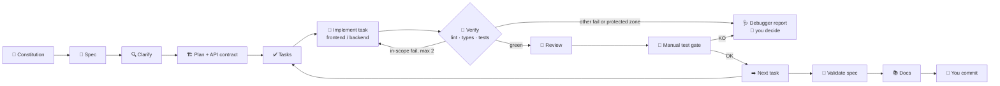

<div align="center">

# 🧭 sdd-harness

**A portable, human-in-the-loop harness for Spec-Driven Development with AI coding agents.**
Specs first. Sub-agents for frontend and backend. Deterministic guardrails. You stay in control.

[](README.md)
[](README.es.md)


</div>

---

> [!WARNING]
> 🚧 **Work in progress.** This README describes the target design. Commands marked as planned in the [roadmap](#-roadmap) may not exist yet.

## ✨ What is this?

**Agent = model + harness.** The harness is everything around the model: context, memory, orchestration, verification, and cost control. `sdd-harness` packages all of that into a CLI you install **once** and enable **per project**. Projects that don't opt in are never touched.

It implements the Spec-Driven Development flow:

**Constitution → Spec → Clarify → Plan → Tasks → Implement (one task at a time, tests first) → Validate → Change (spec first, code later).**

On top of that flow it adds sub-agents for frontend and backend, a QA agent, a reviewer, a debugger and a docs writer, all coordinated by an orchestrator. At every point that matters, the harness **stops and asks you**.

### 🧠 Core principle

> **Markdown rules are suggestions. Permissions and hooks are laws.**

Everything you consider non-negotiable is enforced by scripts, not by prompts alone. That covers commits, dependencies, architecture changes, database changes, retry loops, and stray `.md` files.

---

## 🚀 Features

| | Feature | What it means for you |
|---|---|---|
| 📝 | **Spec-Driven flow** | Numbered EARS requirements (`RF-1…`), clarification, plan, API contract, tasks with "Done when" |
| 🤖 | **Specialized sub-agents** | Frontend and backend work separately, each only in its own paths |
| 🎨 | **Design-aware frontend** | Design skills, a reusable design system and components; design source is configurable (none, tokens-in-code, Penpot, Figma) |
| 🔐 | **Secure, architecture-aware backend** | Layering, API conventions, secure coding, safe DB migrations |
| 🧪 | **QA agent** | Unit, integration and E2E (Playwright), with reproducible bug reports |
| 🛑 | **Human gates** | No commits, no new dependencies, no stack/architecture/DB changes without your OK. You manually test every task |
| 🔁 | **Loop breaker** | At most 2 automatic retries, and only for in-scope fixes. Anything else stops with a report and options |
| 🗂️ | **Tidy repo** | `.md` whitelist: agents can't create documents wherever they like |
| 🔌 | **Multi-tool** | One neutral core, adapters for Claude Code, opencode, Codex and Antigravity |
| 🧩 | **Any topology** | Single repo, monorepo, multi-repo, or a workspace folder with several repos |
| 📋 | **Optional tracker** | Two-way sync with Linear, Notion, GitHub Issues or Jira. Off by default |
| 📊 | **Observability** | Per-task event log, cost per spec, and a model tier per role |
| 🪟 | **Cross-platform** | Pure Node.js. No bash, no symlinks, no dependencies added to your project |

---

## 🔄 The pipeline



---

## ⚡ Quick start

**Requirements:** Node.js ≥ 24 (LTS), Git, and at least one supported agent tool.

```bash
# 1. Install the CLI once (global, nothing else is installed globally)
npm install -g github:attisDev92/Dev-Harness-SDD

# 2. Enable it in a project
cd my-project
sdd-harness-init        # short interview → generates config for THIS project only

# 3. Check everything is wired
sdd-harness doctor
```

Then open your agent tool in the project and start with:

```
/sdd:constitution
/sdd:spec "user login with email and password"
```

To remove it from a project:

```bash
sdd-harness remove      # deletes only generated, unmodified files. Never touches specs/ or docs/
```

---

## 🛠️ CLI commands

| Command | Description |
|---|---|
| `sdd-harness-init` | Interview and install into the current project: tools, topology, stack, conventions, design source, tracker, gates |
| `sdd-harness sync` | Regenerate tool configs from `harness.config.yaml`, showing a diff first |
| `sdd-harness doctor` | Health check, plus the **real enforcement level** for each enabled tool |
| `sdd-harness skills list \| install \| update \| verify` | Manage the required skills and plugins (pinned, verified) |
| `sdd-harness contracts sync` | Refresh API contract snapshots from provider repos |
| `sdd-harness tracker connect \| sync \| status` | Two-way sync between `tasks.md` and your tracker |
| `sdd-harness workspace init` | Set up a local workspace over several repos |
| `sdd-harness upgrade` | Move to a newer harness version, with a diff and confirmation |
| `sdd-harness remove` | Clean uninstall driven by `.harness/manifest.lock` |

## 💬 Workflow commands (inside your agent)

| Command | Phase | Stops for your approval? |
|---|---|---|
| `/sdd:constitution` | Propose project principles | ✅ |
| `/sdd:spec` | Requirements interview → `spec.md` (EARS) | ✅ |
| `/sdd:clarify` | QA review of the spec: gaps, contradictions, conflicts | ✅ |
| `/sdd:plan` | Technical plan, API contract, ADR proposals | ✅ |
| `/sdd:tasks` | Tasks under 30 min with "Done when" | ✅ |
| `/sdd:next` | Run **one** task end to end, then stop for manual testing | ✅ |
| `/sdd:validate` | Walk through every RF: which test covers it, and the verdict | ✅ |
| `/sdd:change` | New requirement: update the spec first, show the diff | ✅ |
| `/sdd:status` | Current spec, task, blockers, pending decisions, cost | — |
| `/sdd:commit` | **Proposes** commit messages per repo. You run the commit | ✅ |
| `/sdd:approve` · `/sdd:reject <reason>` | Your answer to a pending decision (for manual tests you can also reply `OK` / `KO <what failed>`) | — |

> [!NOTE]
> Invocation syntax varies by tool. For example, Codex invokes skills as `$name`, and Antigravity exposes these as workflows under `/`. `sdd-harness doctor` prints the right syntax for your setup.

---

## 🤖 Agents

Only the agents your project needs are generated. A frontend-only project gets no backend agent.

| Agent | Role | Writes to | Key skills | Tier |
|---|---|---|---|---|
| 🧐 `spec-reviewer` | QA of the spec. Detects problems, never resolves them | — (read only) | spec-generator (review mode) | high |
| 🏗️ `architect` | Plan, API contract, ADR proposals | `specs/**`, `docs/decisions/**` | api-design, backend-architecture, adr | high |
| 🎨 `frontend-dev` | UI, design system, components | frontend paths only | frontend-design, design-system, web-design-guidelines, clean-code, TDD (+ React/Next skills if detected) | mid |
| ⚙️ `backend-dev` | API, domain, persistence | backend paths only | backend-architecture, api-design, secure-coding, db-migrations, clean-code, TDD (+ Postgres skill if detected) | mid |
| 🧪 `qa-tester` | Unit, integration, E2E, bug reports | `tests/**`, `e2e/**` | webapp-testing, testing-strategy, TDD | mid |
| 👀 `reviewer` | Spec compliance, then code quality and security | — (read only) | code-review, secure-coding, verification-before-completion | high |
| 🩺 `debugger` | Root-cause triage. Reports options, **does not fix** | — (read only) | systematic-debugging, triage-report | high |
| 📚 `doc-writer` | Updates whitelisted docs only | whitelisted `.md` | docs-writer | low |

Tiers (`high` / `mid` / `low`) map to concrete models per tool through the adapters.

> [!IMPORTANT]
> In Claude Code, sub-agents cannot spawn other sub-agents, so the **orchestrator is your main session**, driven by the `/sdd:*` commands. In tools without equivalent sub-agents, the harness runs in **degraded mode**: roles run one after another in the same agent. The gates still apply.

---

## 🧩 Skills

The harness bundles its own skills and installs curated third-party skills **on demand, pinned and verified**. Skills are loaded per role and per detected stack, so an agent never carries skills it doesn't need.

### Bundled (owned by the harness)

| Skill | Used by | Purpose |
|---|---|---|
| `sdd-orchestrator` | main session | Pipeline state machine, gates, retries, `progress.md` |
| `spec-generator` | spec phase | Requirements interview and EARS spec (inspired by [hello-sdd](https://github.com/mouredev/hello-sdd)) |
| `clean-code` | frontend, backend | Naming, small units, KISS/YAGNI/DRY, no premature abstraction. **Project conventions win** |
| `design-system` | frontend | Tokens, component API, variants, states. Adapts to the chosen design source |
| `backend-architecture` | backend, architect | Layers, boundaries, dependency direction, error handling, validation at the edges |
| `api-design` | backend, architect | REST conventions, pagination, a consistent error format, versioning, contract-first |
| `secure-coding` | backend, reviewer | OWASP-based checklist: authN/authZ, input handling, secrets, headers |
| `db-migrations` | backend | Safe migrations (expand/contract, reversible). Every schema change goes through a gate |
| `testing-strategy` | QA | Test pyramid, test data, avoiding flaky tests, one or more tests per RF |
| `triage-report` | debugger | Fixed report format: error, reproduction, hypotheses, 2–3 options, recommendation. Then stop |
| `adr` | architect | Architecture Decision Records with the discarded alternatives |
| `docs-writer` | docs | Docs whitelist, README/CHANGELOG/architecture updates |

### Curated third-party (installed if missing)

| Skill | Source | Installed when |
|---|---|---|
| `frontend-design` | anthropics | a frontend component exists |
| `webapp-testing` | anthropics | a web frontend exists (Playwright) |
| `web-design-guidelines` | vercel-labs | listed but blocked: it declares no license (RF-SKL-15) |
| `vercel-react-best-practices`, `vercel-composition-patterns` | vercel-labs | React or Next.js detected |
| `supabase-postgres-best-practices` | supabase | PostgreSQL detected |
| `test-driven-development`, `systematic-debugging`, `verification-before-completion` | obra/superpowers | always (these individual skills only, not the whole plugin) |

With `design.source: figma` or `penpot` the harness configures the design tool's MCP server in `.mcp.json` instead of a skill. To propose a skill for the registry, see [docs/guides/skills-registry.md](docs/guides/skills-registry.md).

> [!CAUTION]
> Published skills can contain malicious hooks or scripts. The installer **only** installs skills from the curated registry. Each one is pinned to a commit SHA, verified by hash and license, and listed for your confirmation **before** installation. It never installs anything globally. New registry entries go through code review.

---

## 🛑 Guardrails

| Rule | Mechanism |
|---|---|
| 🚫 **No commits, pushes, resets or rebases by agents** | Tool permissions + a pre-tool hook. `/sdd:commit` only proposes messages, you commit |
| 📦 **No new dependencies without asking** | `ask` permission on install commands + a guard on dependency manifests and lockfiles |
| 🏛️ **Stack, architecture, DB or security changes need your OK** | "Protected zones" in the config: any edit there triggers a gate and an ADR proposal |
| 🔁 **No infinite loops** | Attempt counter: max **2** automatic retries, and only for fixes inside the task scope. Everything else → debugger report → you choose |
| 🧑 **You test every implementation** | After each task: URL, steps and test data, then the agent waits for your OK or KO (granularity configurable) |
| 🗂️ **No random `.md` files** | Write hook with a whitelist. Anything else requires your explicit request |
| 🧱 **Agents stay in their lane** | Path ownership per agent, checked on sub-agent stop against `git diff` |
| ✅ **No "done" with red tests** | Stop hook blocks completion while verification fails |

**Universal safety net:** git hooks (via `core.hooksPath`, pure Node, no husky) and a CI template run the same checks. That way the tools with weaker enforcement are still covered.

### Enforcement level by tool

| Tool | Context | Skills | Sub-agents | Deterministic blocking | Level |
|---|---|---|---|---|---|
| Claude Code | `CLAUDE.md` → `@AGENTS.md` | ✅ | ✅ | permissions + hooks | 🟢 strong |
| opencode | `AGENTS.md` | ✅ | ✅ | `permission.bash` + plugins | 🟢 medium-strong |
| Codex | `AGENTS.md` | ✅ | ✅ | hooks (beta) + approval policy | 🟡 medium |
| Antigravity | `AGENTS.md` | ✅ | degraded mode | terminal allow/deny list | 🟠 weak → git hooks + CI |

Run `sdd-harness doctor` to see what is actually enforced in your project.

---

## ⚙️ Configuration

`sdd-harness-init` writes `harness.config.yaml`. Here is an example for a workspace with two repos:

```yaml
harness_version: 1.0.0
install_mode: local            # local (default) | team
tools: [claude-code, opencode]

language:                      # detected from existing conventions, then confirmed with you
  code: en
  specs: es
  docs: es
  commits: en
  ui: es

topology: workspace            # single | monorepo | multi-repo | workspace
specs:
  location: root               # root (default) | per-repo (multi-repo / workspace only)
  id_prefix: SPEC              # SPEC-001-login; specs belong to the project, not to a component
components:
  web: { path: ./web-app, stack: "react+vite+ts" }
  api: { path: ./api,     stack: "nestjs+postgres" }

design:
  source: none                 # none | tokens-in-code | penpot | figma

tracker:
  enabled: false               # linear | notion | github | jira, synced both ways

gates:
  manual_test: task            # task | story | spec
  commits: human-only
  deps: ask

retries:
  in_scope: 2                  # only fixes that stay inside the task's files
  protected: 0                 # any protected-zone change → stop and ask

protected:
  deps:         [package.json#dependencies, lockfiles]
  db:           ["**/migrations/**", "**/schema.prisma", "**/*.sql"]
  contracts:    ["specs/**/contracts/**"]
  architecture: ["tsconfig*.json", "**/eslint.config.*", "docker*", ".env*"]
  security:     [auth, cors, csp]

docs_whitelist:
  - README.md
  - CHANGELOG.md
  - "specs/*/{spec,plan,tasks,progress}.md"
  - "docs/decisions/ADR-*.md"
  - "docs/architecture/*.md"
  - docs/lessons.md
```

### Install modes

- **`local` (default).** Generated config is hidden through `.git/info/exclude`, so your `.gitignore` isn't touched either. Each tool's local-only files are used where available. **Tracked files are never modified.** Teammates see nothing.
- **`team`.** Generated config is committed. Existing files get a managed block (`<!-- harness:begin --> … <!-- harness:end -->`) instead of being overwritten.

Specs, contracts and docs are *your* project artifacts. `init` asks whether they are committed or kept local.

### Conventions come first

`init` reads what the project already declares: `AGENTS.md`, `CLAUDE.md`, `CONTRIBUTING.md`, `.editorconfig`, linters. It shows what it detected and asks you to confirm. The precedence is:

**constitution → project conventions → sdd-harness skills → third-party skills**

---

## 🧱 Topologies and specs

| Topology | Where specs and contracts live |
|---|---|
| Any topology (default) | `specs/` at the root, one project prefix (`SPEC-004`) |
| Multi-repo / workspace with `specs.location: per-repo` | **Each repo owns its specs.** `new-spec --component <id>` picks the repo, and a component may define its own optional `id_prefix` (`API-004`) |

In a brand-new empty monorepo, `init` asks for each component's path (e.g. `apps/web`, `apps/api`) and kind, and offers to add another. A spec belongs to the project, not to a component: a full-stack feature is one spec whose tasks each declare their `Component`.

Cross-repo references use stable IDs (`depends_on: api#API-004`). The **provider owns the contract**, and consumers keep a snapshot with origin metadata:

```
api/specs/API-004-auth/contracts/openapi.yaml          ← source of truth
web/specs/WEB-007-login/contracts/external/api-openapi.yaml   ← snapshot (repo, spec, commit)
```

`sdd-harness doctor` warns when a snapshot has drifted from its provider. Adapting to a changed contract always goes through a gate.

### Generated project layout

```
my-project/
├─ harness.config.yaml
├─ AGENTS.md · CLAUDE.md (@AGENTS.md)
├─ .agents/skills/              # canonical skills (+ copies for tools that need them)
├─ .claude/ · .opencode/ · .codex/ · .agents/workflows/   # only for the tools you enabled
├─ .harness/
│  ├─ scripts/                  # guards, in Node
│  ├─ githooks/                 # universal safety net
│  ├─ manifest.lock             # generated files + hashes, used by `remove`
│  ├─ skills.lock               # pinned third-party skills
│  ├─ state/  logs/             # never committed
├─ specs/NNN-feature/  spec · plan · contracts/ · tasks · progress
└─ docs/  constitution · decisions/ · architecture/ · lessons.md
```

---

## 📋 Tracker sync (optional)

- `tasks.md` stays readable. Each task carries its link: `- [ ] T3 … <!-- linear:ABC-123 -->`.
- Only **status, title and new tasks** sync in both directions. The spec is never edited from the tracker.
- Tasks created in the tracker arrive as **proposals** and need your approval.
- Conflicts are **never** resolved automatically. You see both sides and choose.
- Sync runs through the tracker's API, from the CLI, with tokens from environment variables.

---

## 📊 Observability

- `.harness/logs/events.jsonl` records sub-agent, task, result, retries and duration.
- `/sdd:status` shows cost and time per spec and per task.
- A model tier per role keeps expensive models where reasoning actually pays off.
- Native OpenTelemetry is supported where the tool provides it.

---

## 🗺️ Roadmap

- [x] **MVP** Claude Code: `init` / `sync` / `doctor` / `remove` / `upgrade`, full SDD flow, guards, human gates, git hooks, Spanish messages
- [x] Multi-repo and workspace topologies, cross-spec dependencies and contract snapshots
- [ ] opencode, Codex and Antigravity adapters, and degraded mode
- [x] Skills registry and verified installer
- [x] Two-way sync with any tracker: GitHub from the CLI, the rest from the agent through its MCP
- [x] Cross-platform CI matrix (Windows, macOS, Linux · Node 24 LTS)
- [ ] Cost per task, English messages and first stable release

---

## 🤝 Contributing

Contributions are welcome, especially new **adapters**, **tracker connectors** and **curated skills**.

1. Fork and create a branch.
2. This repo is built **with its own method**: open a spec in `specs/` before writing code.
3. New third-party skills need a registry entry (source, pinned SHA, license, hash) and code review: [guide](docs/guides/skills-registry.md).
4. New agent tools: [adapter guide](docs/guides/adapters.md).
5. PRs must pass the Windows, macOS and Linux CI matrix.

Full usage guide: [docs/guides/usage.md](docs/guides/usage.md).

## 🙏 Credits and inspiration

- [**hello-sdd**](https://github.com/mouredev/hello-sdd) by MoureDev: SDD flow, EARS specs, and the idea of the `spec-generator` skill (Apache-2.0). See [NOTICE](NOTICE)
- [**GitHub Spec Kit**](https://github.com/github/spec-kit): the constitution/specify/plan/tasks flow
- [**anthropics/skills**](https://github.com/anthropics/skills): `frontend-design`, `webapp-testing`, `skill-creator`
- [**obra/superpowers**](https://github.com/obra/superpowers): TDD, systematic debugging, verification before completion
- [**vercel-labs/agent-skills**](https://github.com/vercel-labs/agent-skills) and [**supabase/agent-skills**](https://github.com/supabase/agent-skills)
- The **Harness Engineering** idea: *agent = model + harness*

## 📄 License

[Apache-2.0](LICENSE). Third-party skills keep their own licenses and are downloaded from their original sources at install time.

<div align="center">

Made with 🧭 for developers who want AI speed **without** losing control.

</div>
